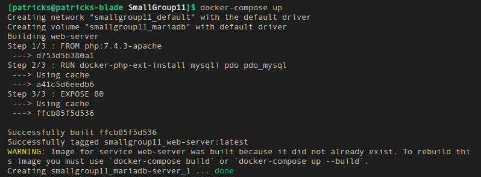
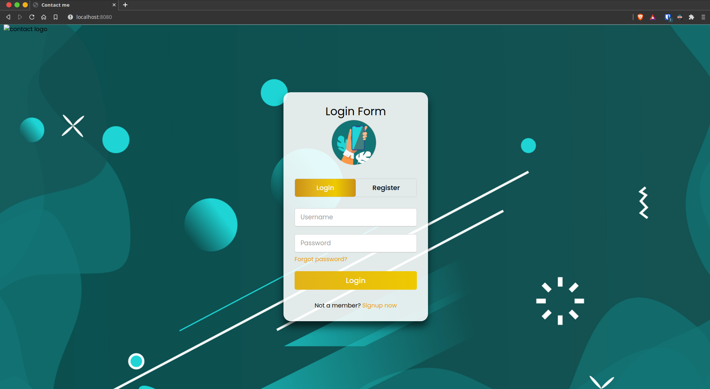
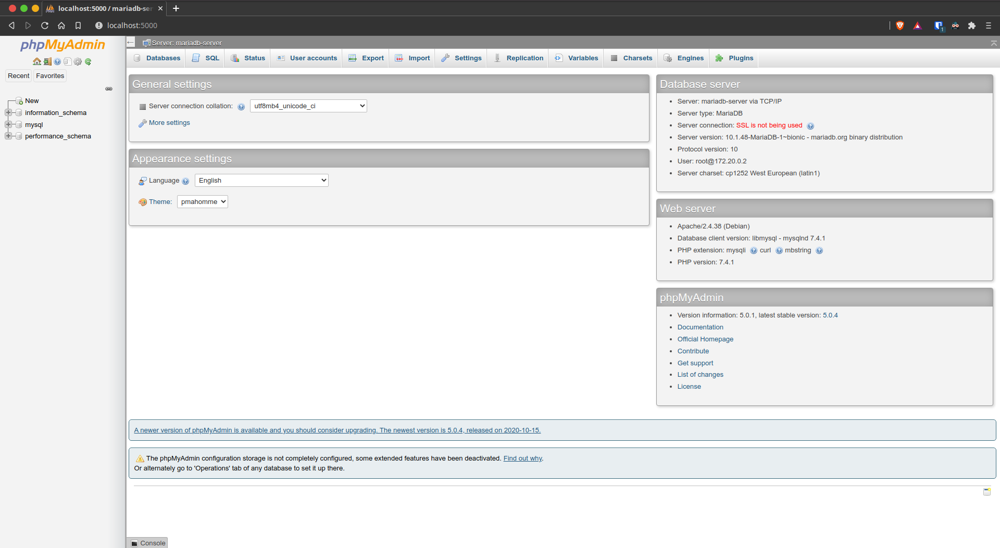
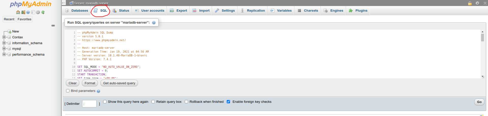

# Contax

It's a contact manager.

# Cloning this project

1. Install git using this guide https://git-scm.com/book/en/v2/Getting-Started-Installing-Git.

2. Clone the repository onto your system. You can use this command `git clone https://github.com/COP-4331C-Group-11/SmallGroup11.git`

# How to use GIT

### Make a branch
`git branch ps/new-feature`

*Note: You need to add your first and last initial followed by your new feature*

### Switch to a branch
`git checkout ps/new-feature`
`git checkout main`

### Add changes
`git add .`
`git commit -m "Changed stuff"`

### Push changes to GitHub
`git push -u origin ps/new-feature`

# How to Run

1. You'll need is Docker. You can visit https://docs.docker.com/get-docker/ to find out how to install it.

2. Run `docker-compose up` in the project directory. (You can use ctrl+C to exit)

*Note: Windows users will need to run* `docker-compose.exe up` 

3. You'll be able to access the website and database through your browser. Navigate to http://localhost:8080 for the website, and http://localhost:5000 to access the database. The website and database are both local versions and cannot affect the server.

*Note: All changes you make should automatically update the container, you just need to reload.*

4. In order to get a copy of the testing database into your local instance, you'll want to copy the contents of Template.sql over to the database. You can do this by pasting the contents into the sql tab and pressing go.

